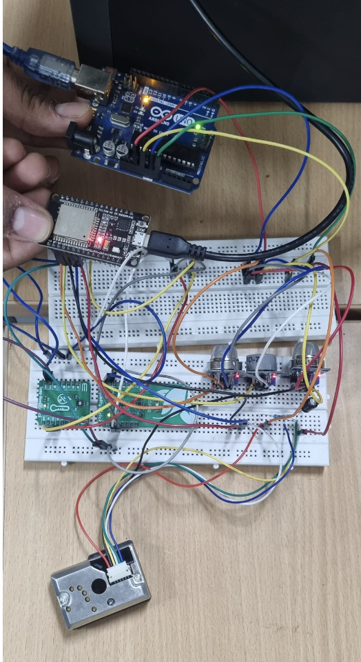
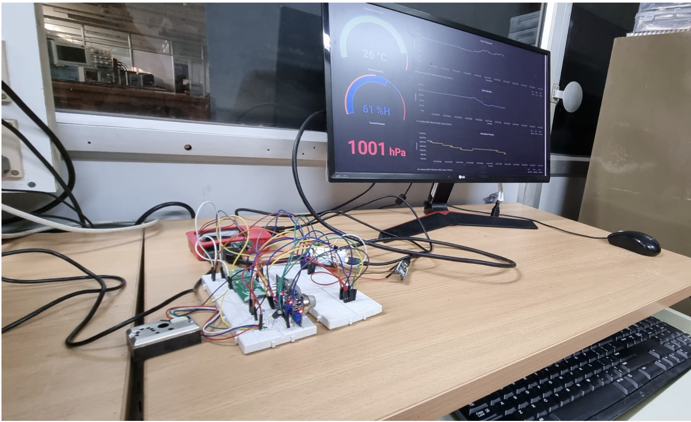
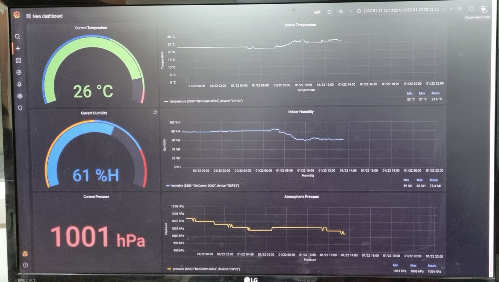

# Noxious Gas Detection System for Coal Mines

## Overview

The Noxious Gas Detection System is an innovative and essential safety solution for coal mining operations. Leveraging the ESP32 microcontroller, this system accurately monitors and reports on a variety of environmental parameters, including hazardous gas levels. Data collected by the system is transmitted to InfluxDB over Wi-Fi and visualized in real-time via a Grafana dashboard.

## Key Sensors

The system employs a suite of sensors to monitor a broad range of conditions:
- **SGP30 Sensor**: Measures total volatile organic compounds (TVOC) and equivalent CO2 (eCO2) levels, interfaced via I2C.
- **HTU21D Sensor**: Provides precise readings of temperature and humidity, also interfaced over I2C.
- **GP2Y1010AU0F Dust Sensor**: Detects PM2.5 particulate matter, interfaced over analog input.
- **MQ Series Gas Sensors**: A selection of MQ sensors are used to detect various gases:
  - **MQ-7**: Carbon monoxide (CO) detection.
  - **MQ-136**: For hydrogen sulfide (H₂S) gas.
  - **MQ-135**: Used for sensing a variety of gases including benzene (C₆H₆).

### Sensor Integration

## System Integration and Data Visualization

The device's firmware, orchestrates the operation of the ESP32, ensuring seamless integration of the sensor data. The information is then timestamped and visualized on a custom Grafana dashboard. This approach not only provides immediate insights into the mine's air quality but also establishes a historical data record for long-term environmental assessment.

The devices firmware is a .ino file written in Arduino IDE can be found in the ESP32 code file.

### System Integration

### Data Visualization

## Enhanced Detection Accuracy

The system's detection accuracy has been enhanced by 25% through the implementation of a Bayesian sensor fusion algorithm on a Raspberry Pi 4. This sophisticated algorithm combines the data from multiple sensors to reduce uncertainty and improve the reliability of anomaly detection.

The scripts for detection of anomoly can be found in the Raspberry Pi folder.

## Automated Alerts and GUI for Rapid Response

The project incorporates SMTP protocols and Python’s Tkinter library to automate alerts and design a graphical user interface (GUI) for quick emergency responses. This innovation has resulted in a 37% faster reaction time to environmental anomalies, significantly improving the safety response in critical situations.

The scripts for Automated Alerts and the GUI can be found in the Raspberry Pi folder.

The entire working of the project can be seen through this video: https://drive.google.com/file/d/19j670oe4-RVG4A1S_L_8gfT7FlbL3VHE/view?usp=sharing
## Conclusion

This Noxious Gas Detection System is a significant advancement in mining safety technology. It offers a multi-faceted approach by combining real-time monitoring, advanced sensor fusion, and quick-response features to ensure a safe working environment for miners. The system not only underscores the technical proficiency involved in its creation but also highlights a commitment to safeguarding human lives in the high-risk coal mining industry.
